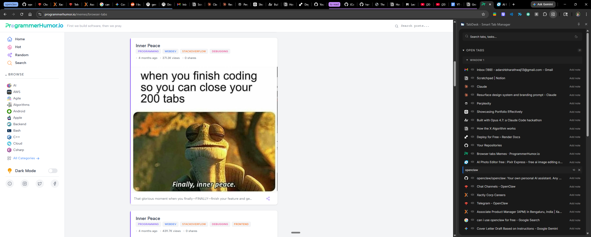
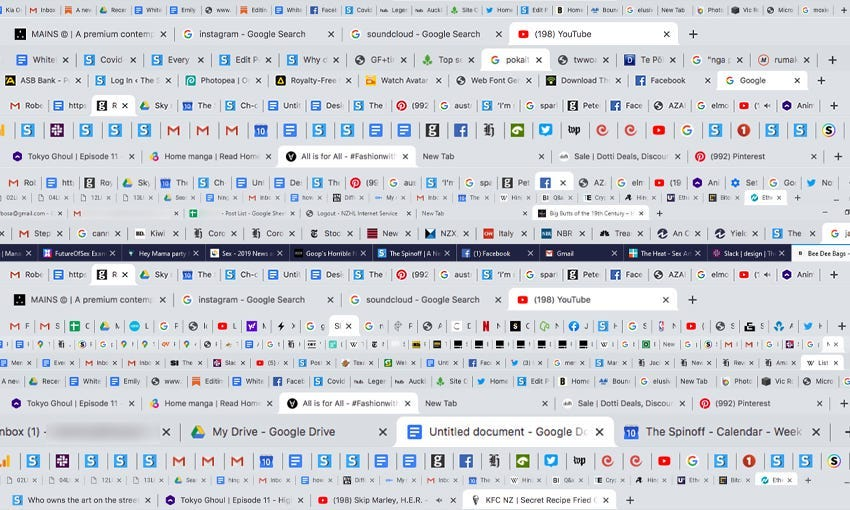

# TabDesk — Smart Tab Manager

> A Chrome side panel extension that turns your open tabs into an actionable workspace.

<p align="center">
  
</p>

---

## The Problem Nobody Talks About (But Everyone Has)

You open Chrome to do one thing. Check a reference. Read a doc. Look something up.

Twenty minutes later you have fourteen tabs open.

An hour later it's thirty-two. You can't remember why half of them exist. Closing them feels wrong — what if you need that one? So you leave them. They pile up. Your RAM groans. Your laptop fan spins up. You start a new window to "start fresh," and now you have two windows each with thirty tabs.

Sound familiar?

<p align="center">
  
  <br>
  <em>The average knowledge worker's browser by 3pm on a Tuesday.</em>
</p>

This isn't a personal failing. It's a product design problem.

**57% of users** describe their tab situation as a significant issue. Studies from Carnegie Mellon University found **30% of users self-identify as tab hoarders**, and the primary reason isn't laziness — it's **fear of losing something important**. The average session runs with **8–10+ tabs open**, and stress from tab clutter kicks in at a median of just **8 tabs**.

Chrome Tab Groups help — until they don't. Collapsed groups are still visual noise. You're still scanning dozens of tiny favicons hoping to find the one you want. The clutter just gets differently shaped.

**TabDesk fixes the root problem:** tabs aren't documents you're viewing, they're tasks you're managing.

---

## What TabDesk Does

TabDesk lives in Chrome's side panel and shows your open tabs as a clean, organized list — grouped by browser window, then by tab group. Every tab is one click away. No scanning. No guessing.

The core insight: **a green dot on a tab means you've already saved it as a task.** That's your signal to close it and stop worrying. The tab is gone; the task stays.

<p align="center">
  
</p>

### Features

| Feature | What it does |
|---|---|
| **Live tab list** | All open tabs, all windows, updated in real time |
| **Green dot sync** | Shows which tabs are already saved as tasks — safe to close |
| **Tab groups** | Displays Chrome tab groups with their colour and name |
| **Save to tasks** | Right-click any tab or group to save it as a task |
| **Inline notes** | Click "Add note" on any tab or task card — auto-saves on blur, keyed by URL |
| **Completed / History** | Checked-off tasks and deleted items are kept for recovery |
| **Suspend tab** | Unload a tab without losing it |
| **Drag & drop** | Drag a tab card directly into Tasks |
| **Search** | Filter across open tabs and saved tasks in one box |
| **Dark / light theme** | Follows your preference, toggleable from settings |
| **Export / Import** | Back up your workspace to JSON and restore it later |

---

## Installation

TabDesk is not on the Chrome Web Store yet. Load it unpacked in about 30 seconds:

1. **Clone or download** this repository
   ```bash
   git clone https://github.com/Adarsh1313/TabDesk.git
   ```

2. Open Chrome and go to `chrome://extensions`

3. Enable **Developer mode** (toggle in the top-right corner)

4. Click **Load unpacked** and select the `TabDesk` folder

5. Click the extensions puzzle icon → pin **TabDesk**

6. Open the side panel with the TabDesk icon, or press the Chrome side panel shortcut

> Permissions used: `sidePanel`, `storage`, `tabs`, `tabGroups`, `contextMenus` — no remote servers, no tracking, all data stays local.

---

## How It Works

### Green Dot Sync

The green dot is the core differentiator. Every time you save a tab as a task, its URL is stored in `chrome.storage.local`. Every time the tab list renders, it checks each tab's URL against saved tasks. A match → green dot. No match → no dot. Close tabs with dots without guilt.

```
open tab URL  ──────► in savedTasks? ──► YES → show green dot → safe to close
                                     └──► NO  → no dot        → still needs attention
```

### Inline Notes

Each tab and task card has a collapsed "Add note" affordance. Click to expand a textarea. Text auto-saves to `chrome.storage.local` on blur, keyed by the tab's URL (`note::{url}`). Empty notes delete themselves. A small dot on the card indicates a note exists.

### Architecture

```
TabDesk/
├── manifest.json          # MV3 manifest
├── background.js          # Service worker (side panel registration)
├── sidepanel.html         # Main UI shell
├── sidepanel.js           # All application logic (~1,600 lines)
├── styles.css             # CSS variables, dark/light theme
├── components/
│   ├── TabCard.js         # Open tab row
│   ├── TaskCard.js        # Saved task row
│   ├── TaskGroupCard.js   # Task group row
│   ├── GroupCard.js       # Chrome tab group row
│   └── Toast.js           # Toast notification
└── lib/
    ├── utils.js           # createElement, formatTimestamp, copyToClipboard
    ├── storage.js         # saveAppState, loadStorage helpers
    ├── tab-operations.js  # Tab actions: suspend, move, group
    └── task-lifecycle.js  # restoreTask, deleteTask, toggleComplete
```

No build step. No bundler. No npm. Open the folder and it runs.

---

## Tech Stack

- **Vanilla JavaScript (ES6+ modules)** — no frameworks, no dependencies
- **Chrome Extension Manifest V3** — service worker, sidePanel API
- **CSS custom properties** — full dark/light theme without a single hardcoded colour
- **`chrome.storage.local`** — all persistence, no external databases

---

## Roadmap

- [ ] README and screenshots (in progress)
- [ ] Chrome Web Store listing
- [ ] Keyboard shortcuts for common actions
- [ ] Tab session snapshots (save all open tabs as a named group)
- [ ] Optional sync across devices via `chrome.storage.sync`

---

## License

[MIT](LICENSE) — © 2025 [Adarsh1313](https://github.com/Adarsh1313)

---

<p align="center">
  Built with Vanilla JS · Chrome MV3 · No frameworks · No tracking
</p>
